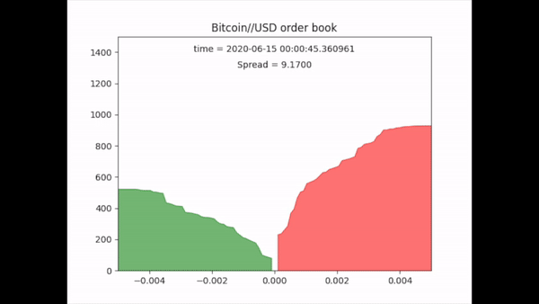

# order-book-reconstruction

Reconstructed trading order book using json objects of trade events. 

Downloaded bitcoin//usd trade data from coinbase in csv format where read into a pandas dataframe in chunks of 100,000 rows for efficent memory management.

Python code chronologically processes each json object and plots the limit order quote on the graph below. This graph details the depth of market against percentage distance from best bid/ask price, current time and the current spread.

# Future Work
1. To develop custom search function to speed up dataprocessing to be able to process quotes in realtime.
2. Speed up plotting by using matplotlib.animate
3. Use CPU multiprocessing and/or GPU in code by using one process for each buy quotes and seel quotes.
4. Intergrate orderbook into deep high frequency trading reinforcement learning trading bot.

## Requirements
* python 3.5.x
* pandas 1.1
* numpy 1.15.0
* matplotlib 3.3.0
* sys
* re
* ast
* datetime
